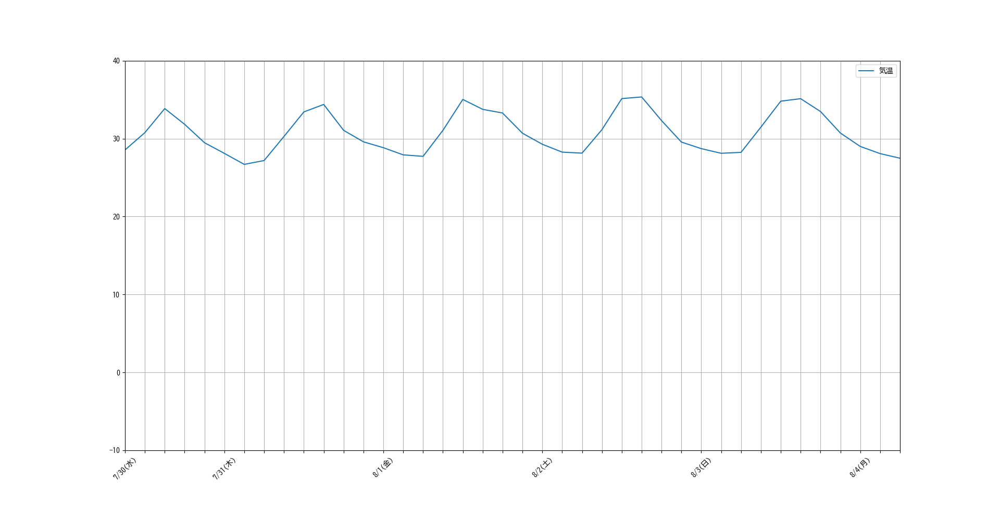

# OpenWeatherMap API を使った都市の気温予測グラフ
## 概要
指定した都市の現在の気温と、今後数日間の気温予測をグラフで可視化するPythonプログラムです。
OpenWeatherMapのAPIから気象データを取得し、matplotlibでグラフを生成します。

## 特徴
* OpenWeatherMap API を利用したリアルタイムの気象データ取得
* matplotlib による気温変化のグラフ化
* APIキーの安全な管理（`.env`ファイルを使用）
* Pythonによるデータ処理と整形
* 曜日の表示

## グラフの例

このグラフは、現在の都市の気温と、今後5日間の予測を示しています。

## 工夫した点・学んだ点

* **外部APIとの連携**: OpenWeatherMap API を利用して、外部サービスからデータを取得する基本的な流れとエラーハンドリングを学びました。
* **APIキーの安全な管理**: .gitignoreを使用し、APIキーをコード内に直接書き込まずに安全に管理する方法を実践しました。これはGitHubに公開する上で非常に重要だと学びました。
* **Git/GitHubによるバージョン管理**: プロジェクトの変更履歴をGitで管理し、GitHubに公開する一連のワークフローを経験しました。
* **データ可視化の基礎**: `matplotlib`を使って、取得した数値を分かりやすいグラフとして表現する方法を学びました。
* **オリジナル機能実装**: 直感的にわかりやすくするために日付だけでなく、曜日表示を実装しました。曜日表示を通してdatetimeモジュールやset関数などこれまでにインプットしたものを実際に使う体験が出来ました。
*（補足）*
当初はスクレイピングで別のサイトから情報を集めてポートフォリオを作成しようと思いましたが、現段階では技術的な難易度か高かったため、まずは一連の流れを学ぶためにpython2年生スクレイピングのコードにオリジナルの機能を加えた今回の気温予測グラフを作成しました。